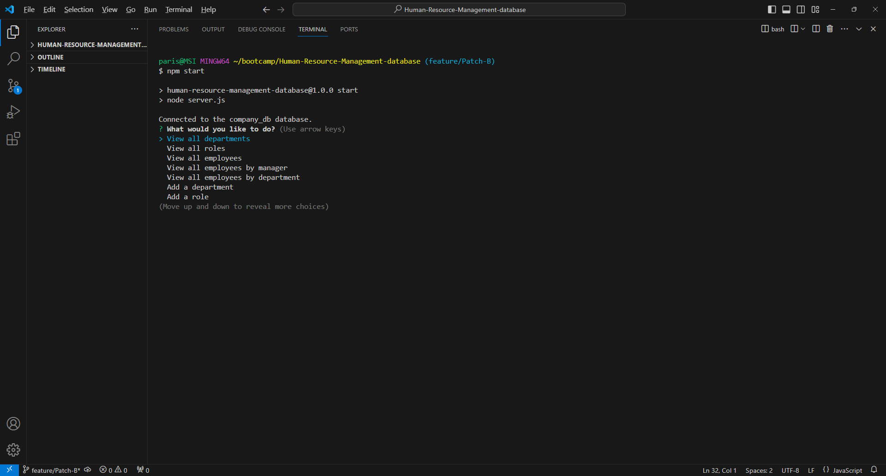
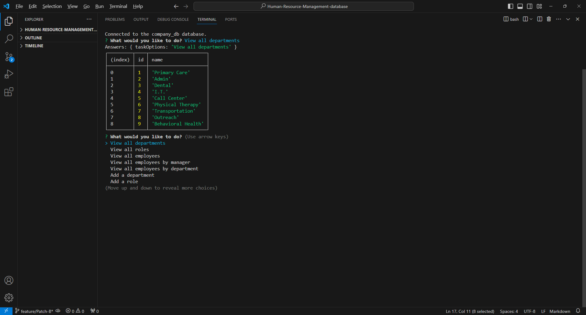
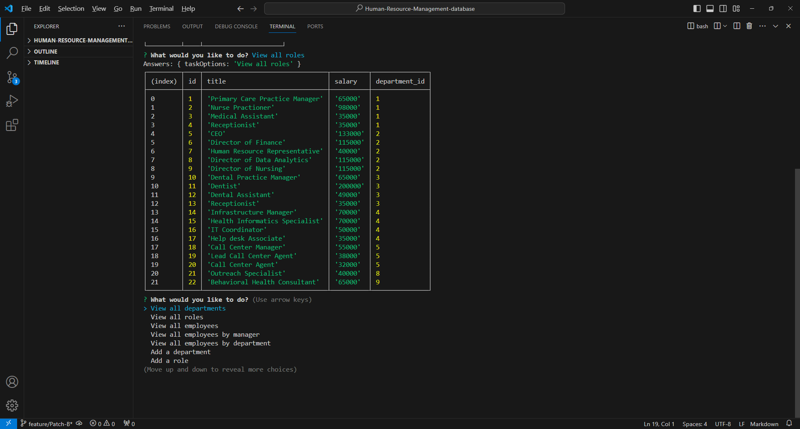
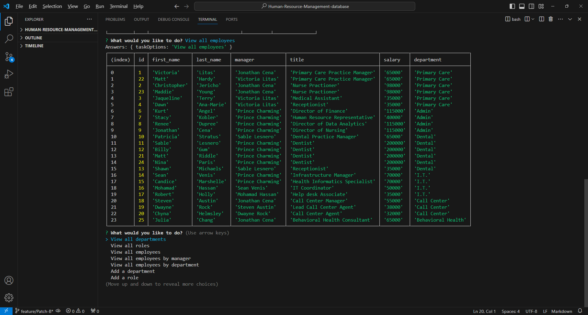
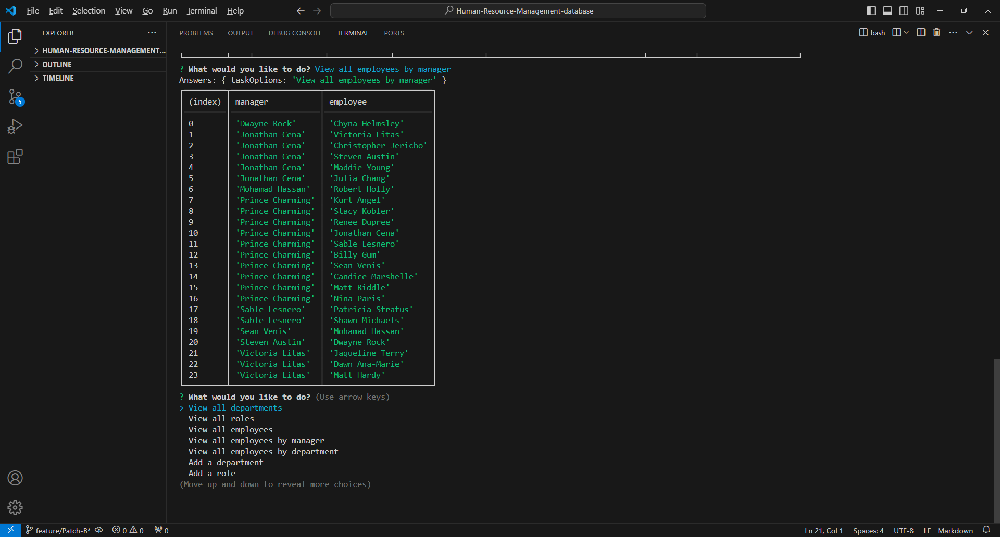
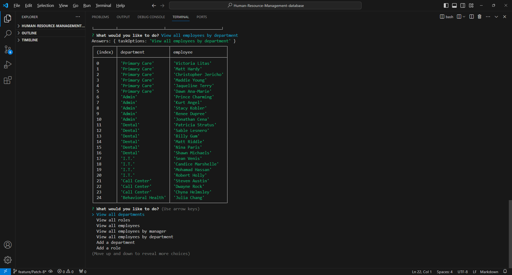

# Human-Resource-Management-database
A database for storing important employee information.

## Description
The Human Resource Management Database is command-line interface application designed to help companies store and manage their employee information. The application’s example depicts a medical company and assist with managing information of various different departments, jobs, and numerous employees within the organization. 

## Installation Requirements
This application requires the use if inquirer, mysql2, and ctable.

## Usage
Connect to the mysql database using the information provided. Source the schema and seeds. Next, open the server in the terminal start the application using “node server.js” Select from the options provided on the main and follow any additional prompts to complete the specific task. 

### Link to Video
https://drive.google.com/file/d/12qxh-eCQzIjHJYmnrp0sCaizNvvyM1xx/view?usp=sharing

### Screenshots

